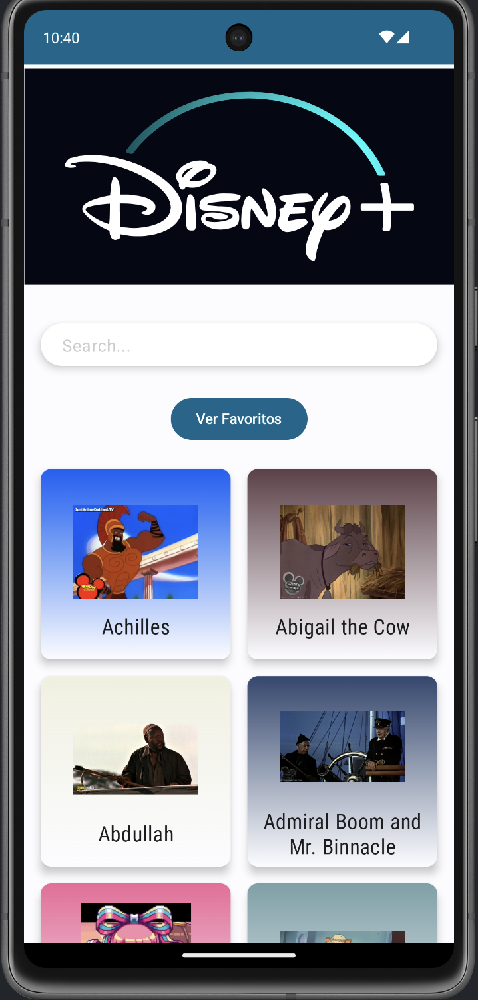
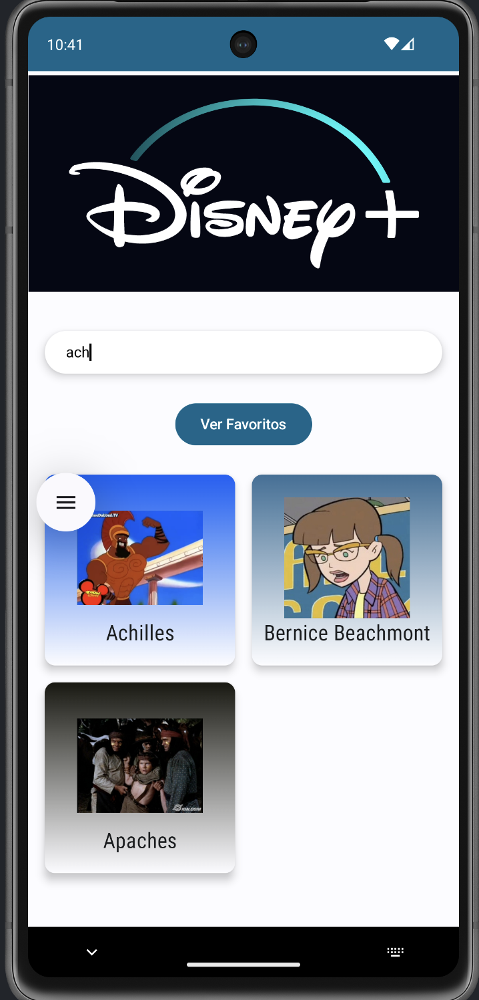
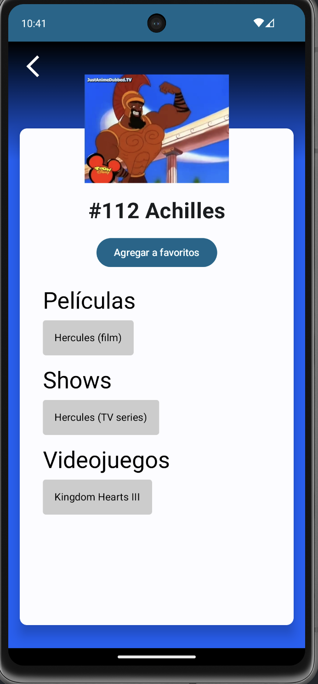
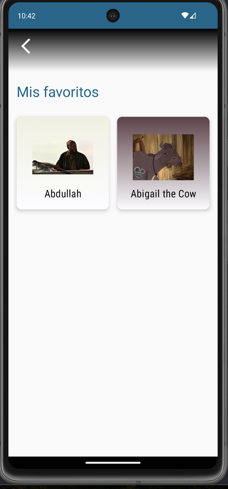

# wikiDisney

¡Bienvenido a wikiDisney! 🎉

wikiDisney es una aplicación que te permite explorar y descubrir información sobre tus personajes favoritos de Disney. Con una interfaz intuitiva y un diseño atractivo, puedes buscar personajes, ver detalles, y más.

## Tecnologías Utilizadas

- **Lenguaje**: Kotlin
- **Framework**: Jetpack Compose
- **Base de datos**: Room
- **Navegación**: Navigation Component
- **Gestión de dependencias**: Dagger Hilt
- **Networking**: Retrofit
- **Imágenes**: Coil

## Características

- Navegación fácil a través de los personajes de Disney.
- Interfaz de usuario atractiva y responsiva.
- Posibilidad de marcar personajes como favoritos.
- Información detallada sobre cada personaje.

## Capturas de Pantalla

Aquí hay algunas capturas de pantalla de la aplicación:
| Pantalla Principal                                   | Búsqueda                                          | Detalles del Personaje                             | Favoritos                               |
|------------------------------------------------------|----------------------------------------------------|----------------------------------------------------|-----------------------------------------|
|  |              |  |  |

## Instalación

Para instalar wikiDisney, clona el repositorio y sigue estos pasos:

1. Abre Android Studio.
2. Selecciona "Import Project" y elige la carpeta del proyecto clonado.
3. Espera a que se sincronicen las dependencias.
4. Conecta tu dispositivo o inicia un emulador.
5. Ejecuta la aplicación.

## Uso

1. Abre la aplicación.
2. Explora la lista de personajes.
3. Toca un personaje para ver más detalles.
4. Marca tus personajes favoritos.

## Licencia

Este proyecto está bajo la [Licencia MIT](LICENSE).

## Contacto

Si tienes alguna pregunta o sugerencia, no dudes en contactarme mandandome un [correo](mailto:angel.angeles.molina@gmail.com).

---

¡Gracias por visitar wikiDisney! 🎈
